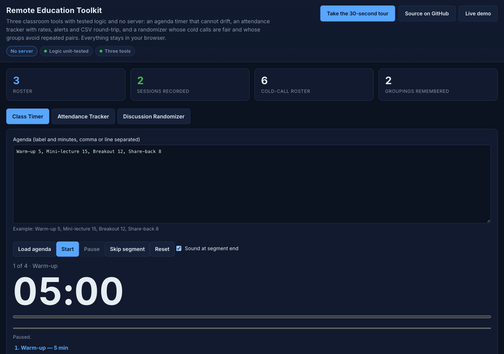
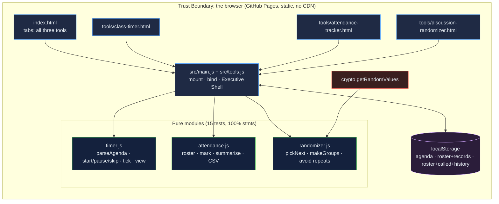

# Remote Education Toolkit: three classroom tools whose logic is tested, whose timer cannot drift, and whose data never leaves the browser

[](https://github.com/Freddricklogan/Remote-Education-Toolkit/actions/workflows/deploy.yml)
[](#5-getting-started--verification)
[](https://github.com/Freddricklogan/Remote-Education-Toolkit/actions/workflows/codeql.yml)
[](LICENSE)
[](https://freddricklogan.github.io/Remote-Education-Toolkit/)

## 1. Executive Summary & Business Impact

**Problem statement.** Small classroom tools are easy to write and easy
to get subtly wrong. The previous version of this toolkit worked, and
still: its timer counted `setInterval` ticks, so a background tab
during screen sharing ran long; its group shuffle used
`sort(() => Math.random() - 0.5)`, which is not uniform; groups never
remembered last week's groups; attendance had no excused status and no
consecutive-absence count; and the CSV it exported could not be
imported (`AUDIT.md`).

**Solution & value delivered.** The same three tools with their logic
moved into tested modules. The **Class Timer** runs a plain-text agenda
of labelled segments from wall-clock timestamps, so a throttled tab
still lands on the right second, with per-segment and whole-agenda
progress and a sound at each boundary. The **Attendance Tracker** keeps
a roster and per-session marks (present, late, absent, excused),
computes rates and consecutive-absence alerts, and exports a CSV that
imports back byte-for-byte. The **Discussion Randomizer** calls
everyone once before anyone twice and draws groups that avoid repeating
pairs across sessions, saying when a repeat was unavoidable. The three
original tool URLs still work; the hub page holds all three in
accessible tabs. No server, no CDN, no telemetry.

**[→ Read the full case study](docs/CASE_STUDY.md)**



## 2. Demonstrated Competencies & Technical Skills

- **EdTech & Human-Centered Design** — agenda-based timing, cold-call
  fairness, pair-history-aware grouping, excused/absent semantics that
  match what teachers act on; `aria-live` status, labelled radio inputs,
  keyboard tabs, no blocking dialogs.
- **Systems & Correctness** — timestamp-driven state machine with
  overshoot carry, Fisher–Yates with injected randomness, best-of-N
  search against a pair-history score, RFC-4180 CSV round trip.
- **Security** — `default-src 'none'; script-src 'self'` with no
  external scripts at all, no `innerHTML`, storage wrapper that survives
  a blocked `localStorage`.
- **Engineering Practice** — three pure modules at 100 % statement
  coverage with failure paths; four pages validated; existing URLs
  preserved.

## 3. System Architecture & Data Flow



Names and attendance are stored only in the teacher's browser and leave
it only through the CSV export the teacher triggers.

## 4. Technical Highlights & Engineering Decisions

### ADR-1 — Time from the clock, not from ticks

**Context.** `setInterval` is throttled in background tabs; a timer
that decrements a counter per tick runs long exactly when a teacher is
sharing another window.

**Decision.** `timer.js` stores `startedAt` and `elapsedBefore`;
elapsed time is computed from `Date.now()` on every render, and `tick`
advances through as many segments as the elapsed time covers, carrying
the overshoot into the next segment.

**Consequence.** The test "a single tick spanning every segment
completes all of them" passes; a tab that wakes after a minute shows
the correct remaining time and has fired the boundary sound once per
segment passed.

### ADR-2 — Fairness that is defined, not assumed

**Context.** `Array.prototype.sort` with a random comparator is not a
uniform shuffle, and independent group draws repeat pairs.

**Decision.** Fisher–Yates with an injected random source
(`crypto.getRandomValues` in the page, a seeded generator in tests).
Cold calls draw without replacement until everyone has been called, then
start a new round. Groups are drawn 200 times against a history of the
last 20 groupings and the draw with the fewest repeated pairs wins; the
number of unavoidable repeats is displayed.

**Consequence.** Tests assert that six picks over six names are a
permutation, that group sizes differ by at most one, that a fresh
grouping against one previous grouping has zero repeats, and that when
every pairing has been used the tool reports the best achievable score
rather than claiming success.

### ADR-3 — Attendance semantics a teacher can defend

**Context.** Present-or-not with a single percentage does not support
the conversations attendance data exists for.

**Decision.** Four statuses. Present and late count as present; excused
is excluded from the denominator and breaks an absence run; the
consecutive-absence count is computed per student across all sessions
and rows at two or more are highlighted. The CSV round-trips.

**Consequence.** A teacher can say precisely what a rate means and can
move the record between this tool and a spreadsheet without loss.

## 5. Getting Started & Verification

**Prerequisites.** Node 22 LTS. No build step; the pages are served from
the repository root.

```bash
git clone https://github.com/Freddricklogan/Remote-Education-Toolkit.git
cd Remote-Education-Toolkit
npm ci
npm run lint && npm run validate && npm run coverage
npx serve .    # open http://localhost:3000
```

**Verification — the numbers this repository actually produced:**

```bash
npm run coverage   # 15 passed / 15; All files 100% stmts, 96.68% branches
npm run lint       # 0 problems
npm run validate   # html-validate index.html tools/*.html: clean (4 pages)
```

| Check | Result |
| --- | --- |
| Unit tests (Vitest) | **15 passed / 15** across 3 files |
| Coverage (pure modules) | **100%** statements, **96.68%** branches (`main.js`, `tools.js`, `ui.js` covered by the browser smoke test) |
| ESLint, html-validate | clean, 4 pages |
| Headless Chrome smoke | **0 console errors**; agenda of 4 segments loads at 05:00, runs, skips to "2 of 4 · Mini-lecture", pauses; roster of 3 with a case-insensitive duplicate rejected; two sessions marked → Ana 100 %, Ben 0 % with 2 consecutive absences (row highlighted), Cy 100 %; six cold calls over six names are a permutation, seventh starts a new round; two groupings of pairs with zero repeated pairs; all three stores persisted; single-tool pages mount with the shell; three tour steps; no horizontal scroll at 1280 or 400 px on every tab |

## 6. Live Demo & Production Showcase

**<https://freddricklogan.github.io/Remote-Education-Toolkit/>** — hub
with all three tools. Individual pages:
[Class Timer](https://freddricklogan.github.io/Remote-Education-Toolkit/tools/class-timer.html) ·
[Attendance Tracker](https://freddricklogan.github.io/Remote-Education-Toolkit/tools/attendance-tracker.html) ·
[Discussion Randomizer](https://freddricklogan.github.io/Remote-Education-Toolkit/tools/discussion-randomizer.html).
Guidance: [Remote teaching best practices](docs/remote-teaching-best-practices.md).

**30-second guided walkthrough.** Press **Take the 30-second tour** on
the hub: it starts the agenda timer, shows the attendance arithmetic,
and draws groups that avoid last week's pairs.
